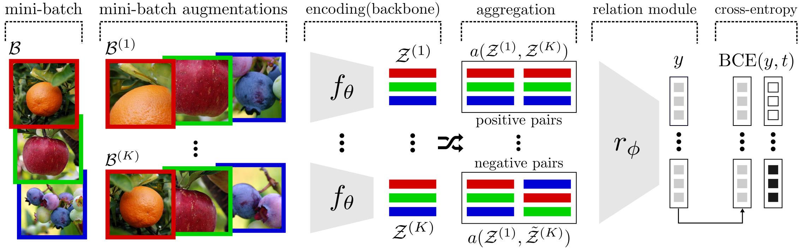

Official PyTorch implementation of the paper *"Self-Supervised Relational Reasoning for Representation Learning"*.

  

Essential code
--------------

Here, you can find the essential code of the method with full training pipeline: 

- [stand-alone python script](./essential_script.py) the stand-alone training script, it only requires PyTorch and Torchvision.
- [jupyter notebook](./essential_notebook.ipynb) step-by-step explanation of the code with both train and linear-evaluation phases.

The essential code above, trains a self-supervised relation module on CIFAR-10 with a Conv4 backbone.
The backbone is stored at the end of the training and can be used for other downstream tasks (e.g. classification, image retrieval).
This has been tested on `Ubuntu 18.04 LTS` with `Python 3.6` and `Pytorch 1.4`.

Code to reproduce the experiments
--------------------------------

Coming soon...

License
-------

MIT License

Copyright (c) 2020 Massimiliano Patacchiola

Permission is hereby granted, free of charge, to any person obtaining a copy
of this software and associated documentation files (the "Software"), to deal
in the Software without restriction, including without limitation the rights
to use, copy, modify, merge, publish, distribute, sublicense, and/or sell
copies of the Software, and to permit persons to whom the Software is
furnished to do so, subject to the following conditions:

The above copyright notice and this permission notice shall be included in all
copies or substantial portions of the Software.

THE SOFTWARE IS PROVIDED "AS IS", WITHOUT WARRANTY OF ANY KIND, EXPRESS OR
IMPLIED, INCLUDING BUT NOT LIMITED TO THE WARRANTIES OF MERCHANTABILITY,
FITNESS FOR A PARTICULAR PURPOSE AND NONINFRINGEMENT. IN NO EVENT SHALL THE
AUTHORS OR COPYRIGHT HOLDERS BE LIABLE FOR ANY CLAIM, DAMAGES OR OTHER
LIABILITY, WHETHER IN AN ACTION OF CONTRACT, TORT OR OTHERWISE, ARISING FROM,
OUT OF OR IN CONNECTION WITH THE SOFTWARE OR THE USE OR OTHER DEALINGS IN THE
SOFTWARE.
