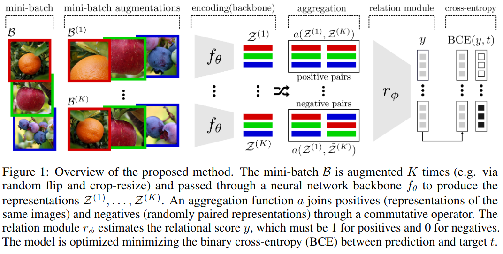

Official PyTorch implementation of the paper:

*"Self-Supervised Relational Reasoning for Representation Learning"* (2020), Patacchiola, M., and Storkey, A., *Advances in Neural Information Processing Systems (NeurIPS)*, *Spotlight (Top 3%)* [[arXiv]](https://arxiv.org/abs/2006.05849)


```bibtex
@inproceedings{patacchiola2020self,
  title={Self-Supervised Relational Reasoning for Representation Learning},
  author={Patacchiola, Massimiliano and Storkey, Amos},
  booktitle={Advances in Neural Information Processing Systems},
  year={2020}
}
```

*Abstract*: In self-supervised learning, a system is tasked with achieving a surrogate objective by defining alternative targets on a set of unlabeled data. The aim is to build useful representations that can be used in downstream tasks, without costly manual annotation. In this work, we propose a novel self-supervised formulation of relational reasoning that allows a learner to bootstrap a signal from information implicit in unlabeled data. Training a relation head to discriminate how entities relate to themselves (intra-reasoning) and other entities (inter-reasoning), results in rich and descriptive representations in the underlying neural network backbone, which can be used in downstream tasks such as classification and image retrieval. We evaluate the proposed method following a rigorous experimental procedure, using standard datasets, protocols, and backbones. Self-supervised relational reasoning outperforms the best competitor in all conditions by an average 14% in accuracy, and the most recent state-of-the-art model by 3%. We link the effectiveness of the method to the maximization of a Bernoulli log-likelihood, which can be considered as a proxy for maximizing the mutual information, resulting in a more efficient objective with respect to the commonly used contrastive losses. 


<p align="center">
  
</p>


Essential code
--------------


Here, you can find the essential code of the method with full training pipeline: 

- [stand-alone python script](./essential_script.py) the stand-alone training script, it only requires PyTorch and Torchvision.
- [jupyter notebook](./essential_notebook.ipynb) step-by-step explanation of the code with both train and linear-evaluation phases.

The essential code above, trains a self-supervised relation module on CIFAR-10 with a Conv4 backbone.
The backbone is stored at the end of the training and can be used for other downstream tasks (e.g. classification, image retrieval). The GPU is not required for those examples. This has been tested on `Ubuntu 18.04 LTS` with `Python 3.6` and `Pytorch 1.4`.

Pretrained models
------------------

- [[download]](https://drive.google.com/file/d/1hPeH76OlVg3syaInF54D-R56nxVrPGbr/view?usp=sharing)[247 MB] Relational Reasoning, [SlimageNet64](https://zenodo.org/record/3672132) (160K images, 64x64 pixels), ResNet-34, trained for 300 epochs
- [[download]](https://drive.google.com/file/d/1qGtrb53PlxS5MC2iuA0KBYYm3XMLwyqB/view?usp=sharing)[82 MB] Relational Reasoning, STL-10 (unlabeled split, 100K images, 96x96 pixels), ResNet-34, trained for 300 epochs
- [[download]](https://drive.google.com/file/d/1b2fDlV742ovFOyDks3evZLFVd_dQGH7T/view?usp=sharing)[10 MB] Relational Reasoning, CIFAR-10 (50K images, 32x32 pixels), ResNet-56, trained for 500 epochs
- [[download]](https://drive.google.com/file/d/12cAY8HVKyh0zZHWswu9kaDkcuyW8PMQ-/view?usp=sharing)[10 MB] Relational Reasoning, CIFAR-100 (50K images, 32x32 pixels), ResNet-56, trained for 500 epochs

Note that, ResNet-34 has 4-hyperblocks (`21 M` parameters) and is larger than ResNet-56 with 3-hyperblocks (`0.8 M` parameters). The archives contain backbone, relation head, and optimizer parameters. Those have been saved in the internal dictionary as `backbone`, `relation`, and `optimizer`. To grab the backbone weights it is possible to use the standard PyTorch loader. For instance, to load the ResNet-34 pretrained on STL-10 the following script can be used:

```python
import torch
import torchvision
my_net = torchvision.models.resnet34()
checkpoint = torch.load("relationnet_stl10_resnet34_seed_1_epoch_300.tar")
my_net.load_state_dict(checkpoint["backbone"], strict=False)
```

The ResNet-34 model can be loaded by using the standard [Torchvision ResNet](https://github.com/pytorch/vision/blob/master/torchvision/models/resnet.py) class or the [resnet_large.py](./backbones/resnet_large.py) class in `./backbones`. Likewise, the ResNet-56 models can be loaded by using the [resnet_small.py](./backbones/resnet_small.py) class in `./backbones` but it is not compatible with the standard Torchvision ResNet class, since it only has three hyperblocks while the Torchvision class has four hyperblocks. A handy class is also contained in [standard.py](./methods/standard.py) under `./methods`, this automatically load the backbone and add a linear layer on top. To load the full model (backbone + relation head) it is necessary to define a new object using the class [relationnet.py](./methods/relationnet.py) and load the checkpoint by using the internal method `load(file_path)`. 


Code to reproduce the experiments
--------------------------------

The code in this repository allows replicating the core results of our experiments. All the methods are contained in the [./methods](./methods) folder. The feature extractors (backbones) are contained in the [./backbones](./backbones) folder. The code is modular and new methods and dataset can be easily included. Checkpoints and logs are automatically saved in `./checkpoint/METHOD_NAME/DATASET_NAME`, most of the datasets are automatically downloaded and stored in `./data` (SlimageNet64 and tiny-ImageNet need to be downloaded separately). The tiny-ImageNet dataset needs to be downloaded [from here](http://cs231n.stanford.edu/tiny-imagenet-200.zip), then it must be unpacked and pre-processed using [this script](https://gist.github.com/mpatacchiola/3e82d5790f66bae39c77cdbabac883a6). In the paper (and appendix) we have reported the parameters for all conditions. Here is a list of the parameters used in our experiments:

*Methods*: `relationnet` (ours), `simclr`, `deepcluster`, `deepinfomax`, `rotationnet`, `randomweights` (lower bound), and `standard` (upper bound).

*Datasets*: `cifar10`, `cifar100`, `supercifar100`, `stl10`, `slim` ([SlimageNet64](https://zenodo.org/record/3672132)), and `tiny` ([tiny-ImageNet](http://cs231n.stanford.edu/tiny-imagenet-200.zip)).

*Backbones*: `conv4`, `resnet8`, `resnet32`, `resnet56`, and `resnet34` (larger with 4 hyper-blocks).

*Mini-batch size*: `128` for all methods, `64` for our method with `K=32` (if your GPU has enough memory you can increase `K`).

*Epochs*: `200` for unsupervised training (`300` for STL-10), and `100` for linear evaluation.

*Seeds*: `1`, `2`, `3` (our results are the average over these three seeds).

**Memory:** self-supervised methods can be expensive in terms of memory. For our method, you may have to decrease the value of `K` to avoid that your CPU/GPU memory gets saturated. In our experiments we managed to fit into a *NVIDIA GeForce RTX 2080* a model with `backbone=resnet56`, mini-batch `data_size=64`, and augmentations `K=32`. Note that, depending on the number of augmentations, mini-batch size, and your particular hardware, it may take from a few seconds up to several minutes to complete a single epoch.

For training and evaluation there are three stages: 1) unsupervised training, 2) training through linear evaluation, 3) test. Those are described below.

**1) Unsupervised training**

Each method should be trained on the unsupervised version of the base dataset. This is managed by the file [train_unsupervised.py](train_unsupervised.py). In the following example we train our *Self-Supervised Relational* method on CIFAR-10 using a Conv-4 backbone with a mini-batch of size 64 and 32 augmentations for *200 epochs*:

```
python train_unsupervised.py --dataset="cifar10" --method="relationnet" --backbone="conv4" --seed=1 --data_size=64 --K=32 --gpu=0 --epochs=200
```
Note that, when using `method=standard` labels are used since this corresponds to the supervised upper-bound. In all other cases labels are discarded and each method is trained following its own self-supervised routine.


**2) Training through linear evaluation**

This procedure consists of taking the checkpoint saved at the end of the previous phase, load the backbone in memory, and replace the last linear layer with a new one. Then the last layer is trained (no training of the backbone) for *100 epochs*. This procedure allows checking if useful representations have been learned in the previous stage. This phase is managed in the file [train_linear_evaluation.py](train_linear_evaluation.py). An example is the following:

```
python train_linear_evaluation.py --dataset="cifar10" --method="relationnet" --backbone="conv4" --seed=1 --data_size=128 --gpu=0 --epochs=100 --checkpoint="./checkpoint/relationnet/cifar10/relationnet_cifar10_conv4_seed_1_epoch_200.tar"
```

The additional parameter `--finetune=True` can be added if you want to train also the backbone (fine-tune using a smaller learning rate).
For the cross-domain experiments, the linear evaluation must be done on another dataset. For instance, for the condition CIFAR-10 -> CIFAR-100 the phase 1) must be done using `cifar10` and phase 2) using `cifar100`. Similarly, for the coarse-grained experiments training in phase 1) must be done on `cifar100` and in phase 2) on `supercifar100` (using the 20 super-classes of CIFAR-100).


**3) Test**

The last stage just consists of testing the model trained during the linear evaluation on the unseen test set. Note that, at the end of the previous phase a new checkpoint is saved and this should be loaded in memory now. This phase is managed by the file [test.py](test.py). An example of command is the following:

```
python test.py --dataset="cifar10" --backbone="conv4" --seed=1 --data_size=128 --gpu=0 --checkpoint="./checkpoint/relationnet/cifar10/relationnet_cifar10_conv4_seed_1_epoch_100_linear_evaluation.tar"
```

Test on cross-domain conditions should be done by selecting the appropriate dataset at test time. The rule is to use the same dataset used in phase 2). For instance, in the cross-domain condition CIFAR-100 -> CIFAR-100 the test set should be `cifar100`.

License
-------

MIT License

Copyright (c) 2020 Massimiliano Patacchiola

Permission is hereby granted, free of charge, to any person obtaining a copy
of this software and associated documentation files (the "Software"), to deal
in the Software without restriction, including without limitation the rights
to use, copy, modify, merge, publish, distribute, sublicense, and/or sell
copies of the Software, and to permit persons to whom the Software is
furnished to do so, subject to the following conditions:

The above copyright notice and this permission notice shall be included in all
copies or substantial portions of the Software.

THE SOFTWARE IS PROVIDED "AS IS", WITHOUT WARRANTY OF ANY KIND, EXPRESS OR
IMPLIED, INCLUDING BUT NOT LIMITED TO THE WARRANTIES OF MERCHANTABILITY,
FITNESS FOR A PARTICULAR PURPOSE AND NONINFRINGEMENT. IN NO EVENT SHALL THE
AUTHORS OR COPYRIGHT HOLDERS BE LIABLE FOR ANY CLAIM, DAMAGES OR OTHER
LIABILITY, WHETHER IN AN ACTION OF CONTRACT, TORT OR OTHERWISE, ARISING FROM,
OUT OF OR IN CONNECTION WITH THE SOFTWARE OR THE USE OR OTHER DEALINGS IN THE
SOFTWARE.
